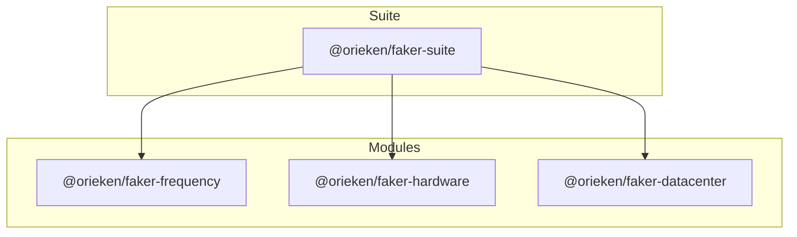

# Orieken Faker Suite Monorepo

A TypeScript monorepo providing deterministic, seedable data generation across radio frequency bands, hardware specifications, and datacenter scenarios. It exposes a unified facade `fakerSuite` that composes the underlying libraries.

## Packages


- `@orieken/faker-frequency` – Frequency band & channel generation (VHF/UHF/SHF/EHF), unit converters, overrides.
- `@orieken/faker-hardware` – Rack, server, power supply, storage arrays, network gear with strategy profiles.
- `@orieken/faker-datacenter` – Composable datacenter scenario (rooms → rows → racks + telemetry, cooling, fabric).
- `@orieken/faker-suite` – Facade aggregator exposing a single API.

## Features
- Deterministic seeding across all modules.
- Strategy pattern for server profiles (general-purpose, high-performance, storage-optimized).
- Frequency band overrides with validation.
- Scenario generator for full datacenter graphs.
- Typed pure functions; ready for testing & extension.

## Getting Started

### Install dependencies
```bash
npm install
```

### Build all packages
```bash
npm run build
```

### Run tests (all workspaces)
```bash
npm run test
```

### Clean build artifacts
```bash
npm run clean
```

## Usage
Below examples assume you have `@faker-js/faker` installed.

```ts
import { faker } from '@faker-js/faker';
import { fakerSuite } from '@orieken/faker-suite'; // if published
// In the monorepo before publishing you can use relative path or tsconfig paths

// Create facade with a seed for deterministic outputs
const fx = fakerSuite(faker, { seed: 123 });

// Frequency generation
const freqMHz = fx.frequency.generateFrequency({ band: 'VHF', unit: 'MHz' });
const channel = fx.frequency.generateChannel({ band: 'UHF' });
console.log('VHF MHz value:', freqMHz);
console.log('UHF channel bandwidth (Hz):', channel.bandwidthHz);

// Hardware generation using a strategy
const perfFx = fakerSuite(faker, { seed: 500, hardware: { serverStrategy: 'high-performance' } });
const server = perfFx.hardware.server();
console.log('High performance server spec:', server);

// Datacenter scenario (1 room, 2 rows, 3 racks each)
const scenario = fx.datacenter.scenario.generate({ rooms: 1, rowsPerRoom: 2, racksPerRow: 3 });
console.log('Scenario cooling units:', scenario.cooling.length);
console.log('First room rack IDs:', scenario.rooms[0].rows.flatMap(r => r.racks.map(rk => rk.id)));

// Override frequency band bounds (narrow VHF window)
const narrow = fakerSuite(faker, {
  seed: 999,
  frequency: { bandOverrides: { VHF: { minHz: 40e6, maxHz: 41e6 } } }
});
const narrowVhf = narrow.frequency.generateFrequency({ band: 'VHF', unit: 'MHz' });
console.log('Narrow VHF MHz value (40–41):', narrowVhf);
```

## Seeding Details
Provide `seed` at the facade level to apply determinism to all modules. Module-level config can refine behavior (e.g. frequency band overrides, hardware server strategy). Reusing the same seed with identical options yields identical output sequences.

## Architectural Notes
- Each package is independent; the facade is a thin composition layer.
- Pure functions & factories enable easy unit testing and future expansion.
- Root TypeScript project references (`tsc -b`) ensure consistent builds.

## Roadmap (High-Level)
See `docs/TODO.md` for the full structured checklist of remaining phases (Playground UI, Storybook, documentation guides, ADRs).

## Contributing
1. Create a feature branch.
2. Add or update tests for any new logic.
3. Run `npm run build && npm run test` before submitting PRs.
4. Update `docs/TODO.md` if scope changes.

## License
MIT (Pending explicit license file addition).
